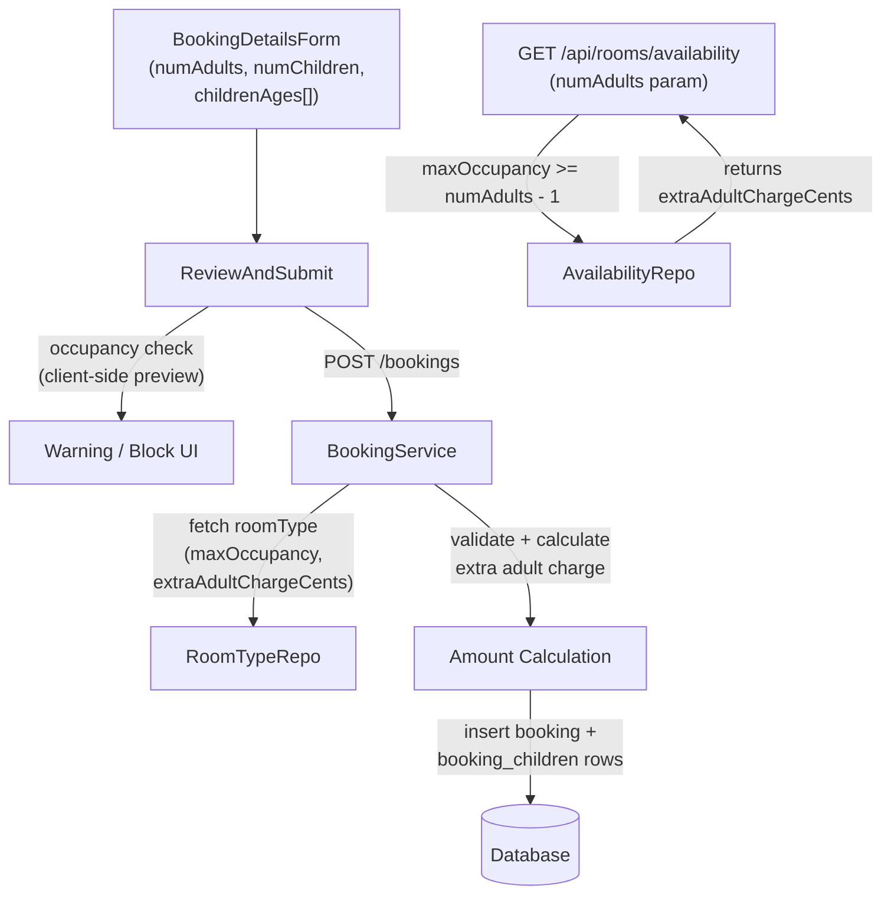

# Children Occupancy Policy Implementation

## Overview

Implement occupancy rules from the brainstorm: only adults (age ≥10) count toward `max_occupancy`, one extra adult is allowed with a flat charge + 5% tax, and 2+ extra adults block the booking. Children's ages are captured per-booking for future auditing. The public availability API is also updated to reflect adult-only capacity filtering.

## Key Files

- Schema: `[backend/drizzle/schema/room_type.ts](backend/drizzle/schema/room_type.ts)`, `[backend/drizzle/schema/booking.ts](backend/drizzle/schema/booking.ts)`
- Booking service: `[backend/src/services/booking.service.ts](backend/src/services/booking.service.ts)`
- Availability: `[backend/src/services/availability.service.ts](backend/src/services/availability.service.ts)`, `[backend/src/repositories/availability.repository.ts](backend/src/repositories/availability.repository.ts)`
- Room type form: `[frontend/src/features/room-type/components/AddEditRoomType.tsx](frontend/src/features/room-type/components/AddEditRoomType.tsx)`
- Booking form: `[frontend/src/features/bookings/components/BookingDetailsForm.tsx](frontend/src/features/bookings/components/BookingDetailsForm.tsx)`
- Price summary: `[frontend/src/features/bookings/components/ReviewAndSubmit.tsx](frontend/src/features/bookings/components/ReviewAndSubmit.tsx)`

---

## 1. Database / Schema

**New migration** with two changes:

- Add `extra_adult_charge_cents INTEGER NOT NULL DEFAULT 100000` to `room_type` table
- Create new `booking_children` table:
  - `id` (PK, auto-increment)
  - `booking_id` (FK → `booking.id`, cascade delete)
  - `age` (INTEGER NOT NULL) — individual child age for auditing

Update Drizzle schema files accordingly:

- `[backend/drizzle/schema/room_type.ts](backend/drizzle/schema/room_type.ts)` — add `extraAdultChargeCents`
- New file: `backend/drizzle/schema/booking_children.ts`

---

## 2. Backend — Booking Service

`**booking.service.ts` — `createBooking` and `updateBooking`:

Occupancy logic (per booking, not per room — `numAdults` is total across all selected rooms):

```
extraAllowed = maxOccupancy * numRooms + 1
if numAdults <= maxOccupancy * numRooms   → normal
if numAdults === extraAllowed             → add extra adult charge + 5% tax
if numAdults >= extraAllowed + 1         → throw validation error (blocked)
```

Extra adult charge line item added to totals:

- `extraAdultChargeCents` (fetched from DB room type, never frontend)
- `extraAdultTaxCents = round(extraAdultChargeCents * 0.05)`
- Both added to `totalAmountCents`

After booking is inserted, write child ages to `booking_children` table (one row per child age in `childrenAges[]` array from request). On update, delete existing rows and reinsert.

**Booking request schema** (`backend/src/schemas/booking.schema.ts`):

- Add optional `childrenAges: z.array(z.number().int().min(0).max(17))` to create/update schemas

---

## 3. Backend — Public Availability API

**Current behavior** (`availability.repository.ts` line 79):

```ts
sql`${roomTypeTable.maxOccupancy} >= ${filters.guestCount}`;
```

**New behavior** — `guestCount` is renamed/reinterpreted as `numAdults` (adults only):

- Show room if it can accommodate guests normally OR with one extra adult:

```ts
sql`${roomTypeTable.maxOccupancy} >= ${filters.numAdults} - 1`;
```

- Include `extraAdultChargeCents` in the availability response payload so the public booking UI can show the surcharge notice

Update `[backend/src/services/availability.service.ts](backend/src/services/availability.service.ts)` and `[backend/src/repositories/availability.repository.ts](backend/src/repositories/availability.repository.ts)`.

---

## 4. Frontend — Room Type Form

`[AddEditRoomType.tsx](frontend/src/features/room-type/components/AddEditRoomType.tsx)`:

- Add **Extra Adult Charge** `InputNumber` field (rupees, converted ×100 to cents on submit), default ₹1,000, placed after `maxOccupancy` field
- Update Zod schema and `RoomTypeFormData` type

`[frontend/src/features/room-type/types/roomType.ts](frontend/src/features/room-type/types/roomType.ts)`:

- Add `extraAdultChargeCents: number` to `RoomType` interface

---

## 5. Frontend — Booking Form

`[BookingDetailsForm.tsx](frontend/src/features/bookings/components/BookingDetailsForm.tsx)`:

- Add helper text under `numChildren` field: _"Enter count of guests under age 10. Children are free and do not affect room capacity."_
- When `numChildren > 0`, render one age `InputNumber` field per child (labeled "Child 1 age", "Child 2 age", etc.) — collected as `childrenAges[]` in form state and sent in API payload

`[frontend/src/features/bookings/types/bookings.ts](frontend/src/features/bookings/types/bookings.ts)`:

- Add `childrenAges?: number[]` to `Booking` interface

---

## 6. Frontend — Booking Price Summary & Validation

`[ReviewAndSubmit.tsx](frontend/src/features/bookings/components/ReviewAndSubmit.tsx)`:

**Occupancy validation** (derived from selected room type `maxOccupancy` and `numRooms`):

- `numAdults === maxOccupancy * numRooms + 1` → show notice: _"One extra adult will be charged ₹X + 5% tax"_
- `numAdults >= maxOccupancy * numRooms + 2` → show blocking error, disable submit: _"Maximum occupancy exceeded. Please book an additional room."_

**Price breakdown additions** (when one extra adult applies):

- Extra Adult Charge: `₹X`
- Extra Adult Tax (5%): `₹Y`

These line items mirror what the backend calculates — the final total is always authoritative from the server.

---

## Data Flow


