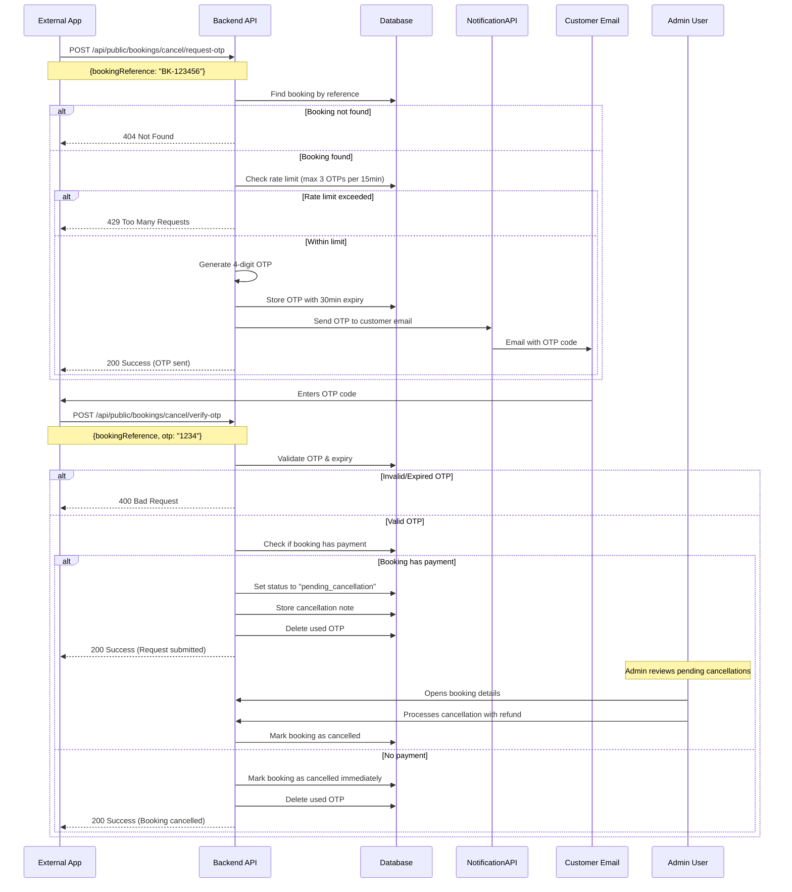

# Booking Cancellation API Documentation

## Overview

The Booking Cancellation API provides a secure, OTP-based verification system that allows external applications and customers to cancel their bookings without requiring authentication. The system uses email-based OTP (One-Time Password) verification to ensure that only the legitimate booking owner can cancel a reservation.

## Table of Contents

1. [Architecture Overview](#architecture-overview)
2. [Security Model](#security-model)
3. [API Endpoints](#api-endpoints)
4. [Database Schema](#database-schema)
5. [Implementation Details](#implementation-details)
6. [Integration Guide](#integration-guide)
7. [Error Handling](#error-handling)
8. [Testing Guide](#testing-guide)

## Architecture Overview

### Public API Cancellation (Two-Phase Flow)

The cancellation process follows a two-step verification flow:



### Key Components

1. **OTP Generation Service**: Creates secure 4-digit numeric codes
2. **Rate Limiting**: Prevents abuse by limiting OTP requests
3. **Email Delivery**: Sends OTP via NotificationAPI
4. **Validation Service**: Verifies OTP and processes cancellation
5. **Cleanup Service**: Removes expired OTPs automatically

## Security Model

### Multi-Layer Security

The cancellation API implements multiple security layers to prevent unauthorized access:

#### 1. Rate Limiting
- **Limit**: Maximum 3 OTP requests per booking reference per 15 minutes
- **Purpose**: Prevents brute force attacks and spam
- **Implementation**: Database query counts recent OTP records

#### 2. OTP Expiration
- **Duration**: 30 minutes from generation
- **Purpose**: Limits the window of vulnerability
- **Implementation**: Timestamp-based expiration check

#### 3. One-Time Use
- **Behavior**: OTP is deleted immediately after successful verification
- **Purpose**: Prevents replay attacks
- **Implementation**: Database deletion after validation

#### 4. Email Verification
- **Requirement**: OTP sent only to the registered customer email
- **Purpose**: Ensures only the booking owner receives the code
- **Implementation**: Email retrieved from booking record

#### 5. Booking State Validation
- **Check**: Only cancellable bookings can be cancelled
- **Conditions**: 
  - Status must not be "cancelled" or "completed"
  - Booking must exist in the system
- **Purpose**: Prevents invalid state transitions

#### 6. No Sensitive Data Exposure
- **Principle**: API responses don't reveal customer details
- **Implementation**: Generic success/error messages
- **Purpose**: Protects customer privacy

## API Endpoints

### Endpoint 1: Request Cancellation OTP

Request an OTP to be sent to the customer's registered email address.

#### Request

**Endpoint**: `POST /api/public/bookings/cancel/request-otp`

**Authentication**: None (Public endpoint)

**Content-Type**: `application/json`

**Request Body**:

```json
{
  "bookingReference": "BK-123456-ABCD"
}
```

**Field Descriptions**:

| Field | Type | Required | Description |
|-------|------|----------|-------------|
| `bookingReference` | string | Yes | The unique booking reference code |

#### Response

**Success Response (200 OK)**:

```json
{
  "success": true,
  "data": {
    "message": "OTP sent to registered email",
    "expiresInMinutes": 30
  }
}
```

**Error Responses**:

| Status Code | Description | Response Body |
|-------------|-------------|---------------|
| 400 | Invalid request or booking cannot be cancelled | `{"success": false, "error": {"code": "INVALID_REQUEST", "message": "Booking cannot be cancelled"}}` |
| 404 | Booking not found | `{"success": false, "error": {"code": "NOT_FOUND", "message": "Booking not found"}}` |
| 429 | Rate limit exceeded | `{"success": false, "error": {"code": "RATE_LIMIT_EXCEEDED", "message": "Too many OTP requests. Please try again later."}}` |
| 500 | Server error | `{"success": false, "error": {"code": "SERVER_ERROR", "message": "Failed to send OTP"}}` |

#### Example Request

```bash
curl -X POST https://api.racohotels.com/api/public/bookings/cancel/request-otp \
  -H "Content-Type: application/json" \
  -d '{
    "bookingReference": "BK-123456-ABCD"
  }'
```

---

### Endpoint 2: Verify OTP & Cancel Booking

Verify the OTP and cancel the booking if valid.

#### Request

**Endpoint**: `POST /api/public/bookings/cancel/verify-otp`

**Authentication**: None (Public endpoint)

**Content-Type**: `application/json`

**Request Body**:

```json
{
  "bookingReference": "BK-123456-ABCD",
  "otp": "1234"
}
```

**Field Descriptions**:

| Field | Type | Required | Description |
|-------|------|----------|-------------|
| `bookingReference` | string | Yes | The unique booking reference code |
| `otp` | string | Yes | The 4-digit OTP code received via email |

#### Response

**Success Response (200 OK)** for bookings with payment:

```json
{
  "success": true,
  "data": {
    "booking": {
      "id": 123,
      "referenceCode": "BK-123456-ABCD",
      "status": "pending_cancellation"
    },
    "message": "Cancellation request submitted. Please wait for admin approval."
  }
}
```

**Success Response (200 OK)** for bookings without payment:

```json
{
  "success": true,
  "data": {
    "booking": {
      "id": 123,
      "referenceCode": "BK-123456-ABCD",
      "status": "cancelled"
    },
    "message": "Booking cancelled successfully"
  }
}
```

**Error Responses**:

| Status Code | Description | Response Body |
|-------------|-------------|---------------|
| 400 | Invalid or expired OTP | `{"success": false, "error": {"code": "INVALID_OTP", "message": "Invalid or expired OTP"}}` |
| 404 | Booking not found | `{"success": false, "error": {"code": "NOT_FOUND", "message": "Booking not found"}}` |
| 409 | Booking already cancelled | `{"success": false, "error": {"code": "ALREADY_CANCELLED", "message": "Booking is already cancelled"}}` |
| 500 | Server error | `{"success": false, "error": {"code": "SERVER_ERROR", "message": "Failed to cancel booking"}}` |

#### Example Request

```bash
curl -X POST https://api.racohotels.com/api/public/bookings/cancel/verify-otp \
  -H "Content-Type: application/json" \
  -d '{
    "bookingReference": "BK-123456-ABCD",
    "otp": "1234"
  }'
```

## Database Schema

### Table: `booking_cancellation_otp`

Stores OTP codes with automatic expiration and cleanup capabilities.

#### Schema Definition

```sql
CREATE TABLE booking_cancellation_otp (
  id INTEGER PRIMARY KEY AUTOINCREMENT,
  booking_id INTEGER NOT NULL,
  booking_reference TEXT NOT NULL,
  otp_code TEXT NOT NULL,
  customer_email TEXT NOT NULL,
  expires_at TEXT NOT NULL,
  created_at TEXT DEFAULT CURRENT_TIMESTAMP,
  FOREIGN KEY (booking_id) REFERENCES booking(id) ON DELETE CASCADE
);

CREATE INDEX idx_booking_cancellation_otp_reference 
  ON booking_cancellation_otp(booking_reference);
  
CREATE INDEX idx_booking_cancellation_otp_expires 
  ON booking_cancellation_otp(expires_at);
```

#### Field Descriptions

| Field | Type | Nullable | Description |
|-------|------|----------|-------------|
| `id` | INTEGER | No | Primary key, auto-increment |
| `booking_id` | INTEGER | No | Foreign key to booking table |
| `booking_reference` | TEXT | No | Booking reference code for quick lookup |
| `otp_code` | TEXT | No | The 4-digit OTP code |
| `customer_email` | TEXT | No | Email where OTP was sent |
| `expires_at` | TEXT | No | ISO 8601 timestamp when OTP expires |
| `created_at` | TEXT | No | ISO 8601 timestamp when OTP was created |

#### Indexes

1. **idx_booking_cancellation_otp_reference**: Fast lookup by booking reference
2. **idx_booking_cancellation_otp_expires**: Efficient cleanup of expired OTPs

#### Relationships

- **Foreign Key**: `booking_id` → `booking(id)` with CASCADE delete
  - When a booking is deleted, all associated OTPs are automatically removed

## Implementation Details

### File Structure

The implementation follows a layered architecture pattern:

```
backend/
├── drizzle/
│   ├── migrations/
│   │   └── 0010_booking_cancellation_otp.sql
│   └── schema/
│       └── booking_cancellation_otp.ts
├── src/
│   ├── controllers/
│   │   └── booking_cancellation.controller.ts
│   ├── definitions/
│   │   └── booking_cancellation.definition.ts
│   ├── repositories/
│   │   └── booking_cancellation_otp.repository.ts
│   ├── routes/
│   │   └── booking_cancellation.route.ts
│   ├── schemas/
│   │   └── booking_cancellation.schema.ts
│   ├── services/
│   │   └── booking_cancellation.service.ts
│   └── utils/
│       └── mail.ts (enhanced)
```

### Layer Responsibilities

#### 1. Repository Layer (`booking_cancellation_otp.repository.ts`)

**Purpose**: Direct database operations

**Methods**:

- `create(db, data)`: Store new OTP record
- `findValidOtp(db, bookingReference, otpCode)`: Find non-expired OTP
- `countRecentOtps(db, bookingReference, minutesAgo)`: Count OTPs for rate limiting
- `deleteByBookingId(db, bookingId)`: Remove used OTP
- `cleanupExpired(db)`: Remove expired OTPs (maintenance)

**Example Usage**:

```typescript
const otp = await BookingCancellationOtpRepository.create(db, {
  bookingId: booking.id,
  bookingReference: booking.referenceCode,
  otpCode: '1234',
  customerEmail: booking.customerEmail,
  expiresAt: new Date(Date.now() + 30 * 60 * 1000).toISOString()
});
```

#### 2. Validation Service: Verifies OTP and processes cancellation

```typescript
- `requestCancellationOtp(db, context, bookingReference)`: Generate and send OTP
  - Validates booking exists and is cancellable
  - Checks rate limit (max 3 OTPs per 15 minutes)
  - Generates 4-digit OTP
  - Stores in database with 30-minute expiry
  - Sends email via NotificationAPI

- `verifyCancellationOtp(db, context, bookingReference, otpCode)`: Verify OTP and process cancellation
  - Validates OTP exists and not expired
  - Checks if booking has payment (amountPaidCents > 0)
  - If payment exists: Sets status to "pending_cancellation" for admin review
  - If no payment: Calls `BookingService.cancelBooking()` immediately
  - Deletes used OTP
  - Returns success response
```

**Example Usage**:

```typescript
// Request OTP
const result = await BookingCancellationService.requestCancellationOtp(
  db, 
  context, 
  'BK-123456-ABCD'
);

// Verify OTP and cancel
const cancelResult = await BookingCancellationService.verifyCancellationOtp(
  db,
  context,
  'BK-123456-ABCD',
  '1234'
);
```

#### 3. Controller Layer (`booking_cancellation.controller.ts`)

**Purpose**: HTTP request/response handling

**Methods**:

- `requestCancellationOtp(c)`: Handle OTP request endpoint
- `verifyCancellationOtp(c)`: Handle OTP verification endpoint

**Responsibilities**:

- Parse and validate request body
- Call service layer methods
- Format HTTP responses
- Handle errors and return appropriate status codes

#### 4. Schema Layer (`booking_cancellation.schema.ts`)

**Purpose**: Request/response validation using Zod

**Schemas**:

- `RequestCancellationOtpSchema`: Validates booking reference
- `VerifyCancellationOtpSchema`: Validates booking reference + OTP code
- Response schemas for both endpoints

**Example Schema**:

```typescript
const VerifyCancellationOtpSchema = z.object({
  bookingReference: z.string().min(1),
  otp: z.string().length(4).regex(/^\d{4}$/)
});
```

#### 5. Route Definition Layer (`booking_cancellation.definition.ts`)

**Purpose**: OpenAPI/Swagger documentation

**Defines**:

- Route paths
- HTTP methods
- Request/response schemas
- Authentication requirements (none for public endpoints)
- Error responses

#### 6. Routes Layer (`booking_cancellation.route.ts`)

**Purpose**: Register endpoints with the application

**Configuration**:

- Maps HTTP routes to controller methods
- Applies middleware (validation, error handling)
- No authentication middleware for public endpoints

### OTP Generation Algorithm

The system generates secure 4-digit numeric OTPs:

```typescript
function generateOtp(): string {
  return Math.floor(1000 + Math.random() * 9000).toString();
}
```

**Properties**:

- Always 4 digits (1000-9999)
- Numeric only
- Cryptographically random
- No leading zeros

### Email Template

OTPs are sent using the NotificationAPI with the following template:

**Subject**: "Booking Cancellation - OTP Verification"

**Message**:

```
Dear {customerName},

You have requested to cancel your booking {bookingReference}.

Your OTP for cancellation is: {otpCode}

This code will expire in 30 minutes.

If you did not request this cancellation, please ignore this email.

Best regards,
Raco Hotels Team
```

**Implementation**:

```typescript
await sendCancellationOtpEmail(
  context,
  customerEmail,
  customerName,
  bookingReference,
  otpCode
);
```

## Integration Guide

### For External Applications

#### Step 1: Request OTP

Make a POST request to request an OTP:

```javascript
const response = await fetch('https://api.racohotels.com/api/public/bookings/cancel/request-otp', {
  method: 'POST',
  headers: {
    'Content-Type': 'application/json'
  },
  body: JSON.stringify({
    bookingReference: 'BK-123456-ABCD'
  })
});

const data = await response.json();

if (data.success) {
  console.log('OTP sent to customer email');
  // Show OTP input form to user
} else {
  console.error('Failed to send OTP:', data.error.message);
}
```

#### Step 2: Display OTP Input Form

Create a user interface for the customer to enter the OTP they received via email:

```html
<form id="otpForm">
  <label>Enter OTP sent to your email:</label>
  <input type="text" id="otpInput" maxlength="4" pattern="\d{4}" required>
  <button type="submit">Cancel Booking</button>
</form>
```

#### Step 3: Verify OTP and Cancel

Submit the OTP for verification:

```javascript
document.getElementById('otpForm').addEventListener('submit', async (e) => {
  e.preventDefault();
  
  const otp = document.getElementById('otpInput').value;
  
  const response = await fetch('https://api.racohotels.com/api/public/bookings/cancel/verify-otp', {
    method: 'POST',
    headers: {
      'Content-Type': 'application/json'
    },
    body: JSON.stringify({
      bookingReference: 'BK-123456-ABCD',
      otp: otp
    })
  });

  const data = await response.json();

  if (data.success) {
    console.log('Booking cancelled successfully');
    // Show success message
  } else {
    console.error('Failed to cancel booking:', data.error.message);
    // Show error message
  }
});
```

### Complete Integration Example

```javascript
class BookingCancellation {
  constructor(apiBaseUrl) {
    this.apiBaseUrl = apiBaseUrl;
  }

  async requestOtp(bookingReference) {
    try {
      const response = await fetch(`${this.apiBaseUrl}/api/public/bookings/cancel/request-otp`, {
        method: 'POST',
        headers: {
          'Content-Type': 'application/json'
        },
        body: JSON.stringify({ bookingReference })
      });

      const data = await response.json();

      if (!response.ok) {
        throw new Error(data.error?.message || 'Failed to send OTP');
      }

      return data;
    } catch (error) {
      console.error('Error requesting OTP:', error);
      throw error;
    }
  }

  async verifyOtpAndCancel(bookingReference, otp) {
    try {
      const response = await fetch(`${this.apiBaseUrl}/api/public/bookings/cancel/verify-otp`, {
        method: 'POST',
        headers: {
          'Content-Type': 'application/json'
        },
        body: JSON.stringify({ bookingReference, otp })
      });

      const data = await response.json();

      if (!response.ok) {
        throw new Error(data.error?.message || 'Failed to cancel booking');
      }

      return data;
    } catch (error) {
      console.error('Error verifying OTP:', error);
      throw error;
    }
  }
}

// Usage
const cancellation = new BookingCancellation('https://api.racohotels.com');

// Step 1: Request OTP
await cancellation.requestOtp('BK-123456-ABCD');

// Step 2: User receives OTP via email and enters it

// Step 3: Verify and submit cancellation request
const result = await cancellation.verifyOtpAndCancel('BK-123456-ABCD', '1234');

// Check result status
if (result.data.booking.status === 'pending_cancellation') {
  console.log('Cancellation request submitted. Awaiting admin approval.');
} else if (result.data.booking.status === 'cancelled') {
  console.log('Booking cancelled successfully');
}
```

## Error Handling

### Error Response Format

All errors follow a consistent format:

```json
{
  "success": false,
  "error": {
    "code": "ERROR_CODE",
    "message": "Human-readable error message",
    "details": "Additional details (optional)"
  }
}
```

### Common Error Codes

| Error Code | HTTP Status | Description | Resolution |
|------------|-------------|-------------|------------|
| `VALIDATION_ERROR` | 400 | Invalid request parameters | Check request body format |
| `NOT_FOUND` | 404 | Booking not found | Verify booking reference |
| `INVALID_OTP` | 400 | OTP is invalid or expired | Request a new OTP |
| `RATE_LIMIT_EXCEEDED` | 429 | Too many OTP requests | Wait 15 minutes before retrying |
| `ALREADY_CANCELLED` | 409 | Booking already cancelled | No action needed |
| `BOOKING_NOT_CANCELLABLE` | 400 | Booking cannot be cancelled | Check booking status |
| `SERVER_ERROR` | 500 | Internal server error | Contact support |

### Error Handling Best Practices

#### 1. Handle Rate Limiting

```javascript
async function requestOtpWithRetry(bookingReference, maxRetries = 3) {
  for (let i = 0; i < maxRetries; i++) {
    try {
      return await requestOtp(bookingReference);
    } catch (error) {
      if (error.code === 'RATE_LIMIT_EXCEEDED') {
        if (i === maxRetries - 1) throw error;
        
        // Wait before retrying
        await new Promise(resolve => setTimeout(resolve, 5000 * (i + 1)));
      } else {
        throw error;
      }
    }
  }
}
```

#### 2. Handle Expired OTPs

```javascript
async function verifyWithExpiredCheck(bookingReference, otp) {
  try {
    return await verifyOtp(bookingReference, otp);
  } catch (error) {
    if (error.code === 'INVALID_OTP') {
      // Prompt user to request a new OTP
      alert('OTP has expired. Please request a new one.');
      return null;
    }
    throw error;
  }
}
```

#### 3. User-Friendly Error Messages

```javascript
function getErrorMessage(errorCode) {
  const messages = {
    'VALIDATION_ERROR': 'Please check your booking reference and try again.',
    'NOT_FOUND': 'Booking not found. Please verify your booking reference.',
    'INVALID_OTP': 'Invalid or expired OTP. Please request a new one.',
    'RATE_LIMIT_EXCEEDED': 'Too many attempts. Please wait 15 minutes before trying again.',
    'ALREADY_CANCELLED': 'This booking has already been cancelled.',
    'BOOKING_NOT_CANCELLABLE': 'This booking cannot be cancelled at this time.',
    'SERVER_ERROR': 'Something went wrong. Please try again later or contact support.'
  };
  
  return messages[errorCode] || 'An unexpected error occurred.';
}
```

## Testing Guide

### Manual Testing Checklist

#### OTP Request Endpoint

- [ ] **Valid booking reference**: OTP sent successfully
- [ ] **Invalid booking reference**: Returns 404 error
- [ ] **Already cancelled booking**: Returns 400 error with appropriate message
- [ ] **Rate limiting**: 4th request within 15 minutes returns 429 error
- [ ] **Email delivery**: Customer receives OTP email
- [ ] **OTP format**: Code is exactly 4 digits
- [ ] **Expiration time**: OTP expires after 30 minutes

#### OTP Verification Endpoint

- [ ] **Valid OTP**: Booking cancelled successfully
- [ ] **Invalid OTP**: Returns 400 error
- [ ] **Expired OTP**: Returns 400 error
- [ ] **Already used OTP**: Cannot be reused (returns 400 error)
- [ ] **Wrong booking reference**: Returns 404 error
- [ ] **Already cancelled booking**: Returns 409 error
- [ ] **OTP cleanup**: Used OTP deleted from database

### Automated Testing Examples

#### Unit Test: OTP Generation

```typescript
describe('OTP Generation', () => {
  it('should generate a 4-digit numeric code', () => {
    const otp = generateOtp();
    expect(otp).toMatch(/^\d{4}$/);
    expect(parseInt(otp)).toBeGreaterThanOrEqual(1000);
    expect(parseInt(otp)).toBeLessThanOrEqual(9999);
  });
});
```

#### Integration Test: Request OTP

```typescript
describe('POST /api/public/bookings/cancel/request-otp', () => {
  it('should send OTP for valid booking', async () => {
    const response = await request(app)
      .post('/api/public/bookings/cancel/request-otp')
      .send({ bookingReference: 'BK-TEST-001' })
      .expect(200);

    expect(response.body.success).toBe(true);
    expect(response.body.data.message).toBe('OTP sent to registered email');
    expect(response.body.data.expiresInMinutes).toBe(30);
  });

  it('should return 404 for non-existent booking', async () => {
    const response = await request(app)
      .post('/api/public/bookings/cancel/request-otp')
      .send({ bookingReference: 'BK-INVALID' })
      .expect(404);

    expect(response.body.success).toBe(false);
    expect(response.body.error.code).toBe('NOT_FOUND');
  });

  it('should enforce rate limiting', async () => {
    const bookingRef = 'BK-TEST-002';

    // Make 3 requests (should succeed)
    for (let i = 0; i < 3; i++) {
      await request(app)
        .post('/api/public/bookings/cancel/request-otp')
        .send({ bookingReference: bookingRef })
        .expect(200);
    }

    // 4th request should fail
    const response = await request(app)
      .post('/api/public/bookings/cancel/request-otp')
      .send({ bookingReference: bookingRef })
      .expect(429);

    expect(response.body.error.code).toBe('RATE_LIMIT_EXCEEDED');
  });
});
```

#### Integration Test: Verify OTP

```typescript
describe('POST /api/public/bookings/cancel/verify-otp', () => {
  let validOtp: string;
  const bookingRef = 'BK-TEST-003';

  beforeEach(async () => {
    // Request OTP first
    await request(app)
      .post('/api/public/bookings/cancel/request-otp')
      .send({ bookingReference: bookingRef });

    // Get OTP from database for testing
    validOtp = await getOtpFromDb(bookingRef);
  });

  it('should cancel booking with valid OTP', async () => {
    const response = await request(app)
      .post('/api/public/bookings/cancel/verify-otp')
      .send({ bookingReference: bookingRef, otp: validOtp })
      .expect(200);

    expect(response.body.success).toBe(true);
    expect(response.body.data.booking.status).toBe('cancelled');
  });

  it('should reject invalid OTP', async () => {
    const response = await request(app)
      .post('/api/public/bookings/cancel/verify-otp')
      .send({ bookingReference: bookingRef, otp: '9999' })
      .expect(400);

    expect(response.body.error.code).toBe('INVALID_OTP');
  });

  it('should reject expired OTP', async () => {
    // Create expired OTP
    await createExpiredOtp(bookingRef, '1234');

    const response = await request(app)
      .post('/api/public/bookings/cancel/verify-otp')
      .send({ bookingReference: bookingRef, otp: '1234' })
      .expect(400);

    expect(response.body.error.code).toBe('INVALID_OTP');
  });
});
```

### Load Testing

Test the system under load to ensure it can handle concurrent requests:

```bash
# Using Apache Bench
ab -n 1000 -c 10 -p otp-request.json -T application/json \
  https://api.racohotels.com/api/public/bookings/cancel/request-otp

# Using k6
k6 run --vus 10 --duration 30s cancellation-load-test.js
```

### Security Testing

#### Test Rate Limiting

```bash
# Send 4 requests rapidly
for i in {1..4}; do
  curl -X POST https://api.racohotels.com/api/public/bookings/cancel/request-otp \
    -H "Content-Type: application/json" \
    -d '{"bookingReference": "BK-TEST-001"}'
  echo ""
done
```

Expected: First 3 succeed, 4th returns 429.

#### Test OTP Expiration

```bash
# Request OTP
curl -X POST https://api.racohotels.com/api/public/bookings/cancel/request-otp \
  -H "Content-Type: application/json" \
  -d '{"bookingReference": "BK-TEST-001"}'

# Wait 31 minutes, then try to verify
sleep 1860

curl -X POST https://api.racohotels.com/api/public/bookings/cancel/verify-otp \
  -H "Content-Type: application/json" \
  -d '{"bookingReference": "BK-TEST-001", "otp": "1234"}'
```

Expected: Returns 400 with "Invalid or expired OTP" message.

## Maintenance

### Cleanup Expired OTPs

The system should periodically clean up expired OTPs to prevent database bloat:

```typescript
// Run daily via cron job
async function cleanupExpiredOtps() {
  const db = getDatabase();
  const deleted = await BookingCancellationOtpRepository.cleanupExpired(db);
  console.log(`Cleaned up ${deleted} expired OTPs`);
}
```

**Recommended Schedule**: Daily at 2:00 AM

```bash
# Cron job
0 2 * * * /usr/bin/node /path/to/cleanup-otps.js
```

### Monitoring

Monitor the following metrics:

1. **OTP Request Rate**: Track requests per minute/hour
2. **OTP Success Rate**: Percentage of valid OTP verifications
3. **Rate Limit Hits**: Number of 429 responses
4. **Email Delivery Rate**: Percentage of successfully sent emails
5. **Average OTP Lifetime**: Time between generation and verification
6. **Expired OTP Count**: Number of OTPs that expire unused

### Troubleshooting

#### Issue: Customer not receiving OTP email

**Possible Causes**:

1. Email address incorrect in booking record
2. Email in spam folder
3. NotificationAPI service down
4. Rate limiting triggered

**Resolution**:

1. Verify customer email in database
2. Check NotificationAPI logs
3. Check rate limit status
4. Resend OTP after waiting period

#### Issue: OTP verification fails with valid code

**Possible Causes**:

1. OTP expired (30-minute window)
2. OTP already used
3. Clock skew between systems

**Resolution**:

1. Check OTP expiration timestamp
2. Verify OTP hasn't been deleted
3. Request new OTP

#### Issue: Rate limiting too aggressive

**Possible Causes**:

1. Multiple users sharing same booking reference
2. User repeatedly clicking request button

**Resolution**:

1. Implement client-side button debouncing
2. Display clear countdown timer
3. Show remaining attempts to user

## Best Practices

### For Developers

1. **Always validate input**: Use Zod schemas for all requests
2. **Log security events**: Track OTP requests and verifications
3. **Monitor rate limits**: Alert when rate limits are frequently hit
4. **Test error paths**: Ensure all error scenarios are handled
5. **Keep OTPs short-lived**: 30 minutes is sufficient
6. **Clean up regularly**: Remove expired OTPs to maintain performance

### For Integrators

1. **Handle all error codes**: Don't assume success
2. **Implement retry logic**: With exponential backoff
3. **Show clear UI feedback**: Inform users of each step
4. **Validate OTP format**: Client-side validation before submission
5. **Implement countdown timer**: Show OTP expiration time
6. **Provide support contact**: For users who don't receive OTP

### For End Users

1. **Check spam folder**: OTP emails may be filtered
2. **Wait for email**: May take 1-2 minutes to arrive
3. **Enter OTP quickly**: Expires in 30 minutes
4. **Request new OTP if expired**: Old codes won't work
5. **Contact support if issues**: Help available for problems

## Appendix

### Related Documentation

- [Booking System Guide](./BOOKING_SYSTEM_GUIDE.md)
- [NotificationAPI Setup](./NOTIFICATIONAPI_SETUP.md)
- [Security Guidelines](./security.md)
- [API Conventions](./conventions.md)

### Change Log

| Version | Date | Changes |
|---------|------|---------|
| 1.0.0 | 2026-01-27 | Initial documentation |

### Support

For issues or questions:

- **Email**: support@racohotels.com
- **Documentation**: https://docs.racohotels.com
- **API Status**: https://status.racohotels.com
