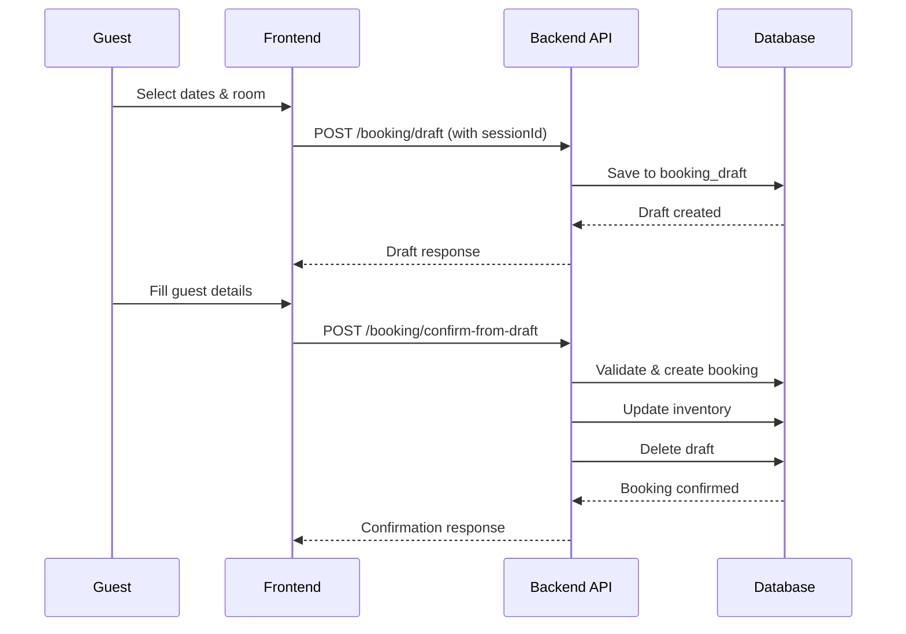
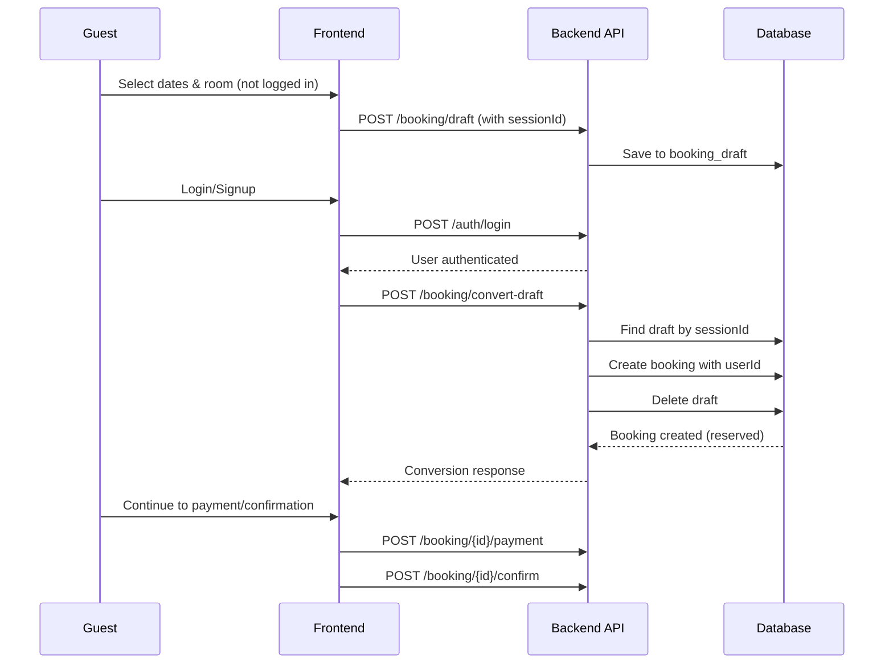
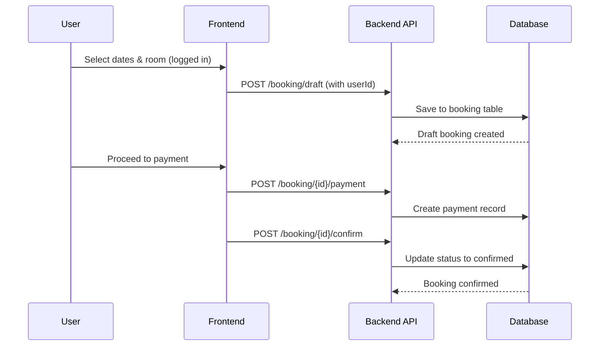
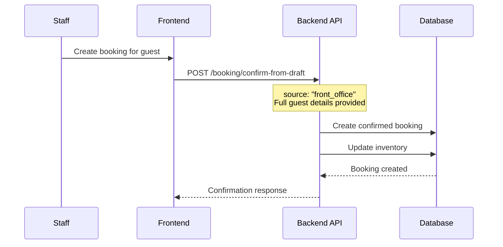

# Booking System Complete Guide

## Overview

The Raco Hotels booking system is designed to handle multiple user types (guests, logged-in users, staff, admin) with a sophisticated flow that supports both guest sessions and authenticated users. The system implements a dual-table approach using `booking_draft` for temporary reservations and `booking` for confirmed bookings.

## Table of Contents

1. [System Architecture](#system-architecture)
2. [User Types & Permissions](#user-types--permissions)
3. [API Endpoints Analysis](#api-endpoints-analysis)
4. [Booking Flows](#booking-flows)
5. [Database Schema](#database-schema)
6. [State Management](#state-management)
7. [Frontend Integration Guidelines](#frontend-integration-guidelines)

## System Architecture

### Core Components

- **Booking Draft System**: Temporary storage for incomplete bookings
- **Booking System**: Final confirmed bookings with inventory management
- **Session Management**: Guest session tracking for non-authenticated users
- **Smart Authentication**: Conditional authentication based on route configuration
- **RBAC (Role-Based Access Control)**: Permission-based access to endpoints

### Key Tables

- `booking_draft`: Temporary bookings (guest sessions, incomplete bookings)
- `booking`: Confirmed bookings with full validation
- `booking_draft_item`: Line items for draft bookings
- `booking_item`: Line items for confirmed bookings
- `payment`: Payment records linked to bookings

## User Types & Permissions

### 1. Guest Users (Non-authenticated)

**Role**: `null` (no authentication)
**Permissions**: None (uses public routes)
**Capabilities**:

- Create draft bookings with `sessionId`
- View public hotel information
- **Cannot**: Access any booking management endpoints

### 2. Logged-in Users (Customers)

**Role**: `guest`
**Permissions**:

- `bookings.read`, `bookings.create`, `bookings.update`, `bookings.delete`
- `hotels.read`, `room_types.read`, `availability.read`

**Capabilities**:

- Create personal bookings
- Convert guest session drafts to their account
- Manage their own bookings
- Submit feedback

### 3. Staff Users

**Role**: `staff`
**Permissions**:

- `bookings.read`, `bookings.update`
- Limited booking management capabilities

**Capabilities**:

- View and manage bookings
- Process payments
- Confirm bookings on behalf of guests

### 4. Admin Users

**Role**: `admin`
**Permissions**: All permissions including:

- `bookings.read`, `bookings.create`, `bookings.update`, `bookings.delete`
- Full system access

**Capabilities**:

- Complete booking management
- Access pending bookings dashboard
- System administration

## API Endpoints Analysis

### 1. `POST /booking/draft`

**Purpose**: Create or update a draft booking
**Authentication**: Smart auth (conditional)
**Permission**: `BOOKINGS_CREATE`
**User Types**: All

**Behavior by User Type**:

- **Guest** (`sessionId` provided, no auth): Saves to `booking_draft` table
- **Logged-in User**: Saves to `booking` table with `userId`

**Use Cases**:

- Guest browsing and selecting rooms
- Logged-in user starting booking process
- Updating booking details before confirmation

**Request Schema**:

```json
{
  "hotelId": 1,
  "roomTypeId": 2,
  "checkInDate": "2024-12-20",
  "checkOutDate": "2024-12-23",
  "numAdults": 2,
  "numChildren": 1,
  "sessionId": "guest_12345" // Optional, for guests
}
```

### 2. `POST /booking/convert-draft`

**Purpose**: Convert guest session draft to authenticated user booking
**Authentication**: Required
**Permission**: `BOOKINGS_CREATE`
**User Types**: Logged-in Users only

**Behavior**:

- Finds draft by `sessionId` or `email`
- Creates new booking with `userId`
- Deletes original draft
- **Does NOT confirm** - creates "reserved" status booking

**Use Cases**:

- User logs in after creating guest draft
- User signs up and wants to claim their session draft

**Request Schema**:

```json
{
  "sessionId": "guest_12345",
  "email": "user@example.com" // Optional fallback
}
```

### 3. `POST /booking/confirm-from-draft`

**Purpose**: Complete booking process from draft with full validation
**Authentication**: Smart auth (conditional)
**Permission**: `BOOKINGS_CREATE`
**User Types**: All (with different behaviors)

**Behavior**:

- Validates guest information
- Processes promo codes
- Validates inventory availability
- **Updates room inventory** (decrements available rooms)
- Creates payment records if prepaid
- Sets status to "confirmed"
- Deletes draft after confirmation

**Use Cases**:

- Guest completing checkout without signup
- Staff creating booking for walk-in guest
- Admin creating booking via front office

**Request Schema**:

```json
{
  "sessionId": "guest_12345",
  "contactEmail": "guest@example.com",
  "contactPhone": "+1234567890",
  "guestName": "John Doe",
  "userId": 123, // Optional
  "source": "web", // web, front_office, phone, email, mobile_app
  "isPrepaid": false,
  "paymentMethod": "card",
  "paymentProcessor": "stripe"
}
```

### 4. `POST /booking/{id}/payment`

**Purpose**: Process payment for existing booking
**Authentication**: Required
**Permission**: `BOOKINGS_UPDATE`
**User Types**: Staff, Admin

**Behavior**:

- Creates payment record
- Updates booking balance
- Mock payment processing

**Use Cases**:

- Processing payment for reserved booking
- Adding partial payments
- Staff processing guest payment

### 5. `POST /booking/{id}/confirm`

**Purpose**: Confirm existing booking
**Authentication**: Required
**Permission**: `BOOKINGS_UPDATE`
**User Types**: Staff, Admin

**Behavior**:

- Changes booking status to "confirmed"
- Sends notifications

**Use Cases**:

- Confirming reserved booking after payment
- Manual confirmation by staff

### 6. `POST /booking/{id}/feedback`

**Purpose**: Submit post-stay feedback
**Authentication**: Required
**Permission**: `BOOKINGS_UPDATE`
**User Types**: All authenticated

**Behavior**:

- Records guest feedback and rating
- Updates booking with review information

**Use Cases**:

- Guest submitting review after checkout
- Post-stay feedback collection

### 7. `GET /booking/pending`

**Purpose**: Retrieve pending booking drafts
**Authentication**: Required
**Permission**: `BOOKINGS_READ`
**User Types**: Staff, Admin

**Behavior**:

- Fetches abandoned booking drafts
- Supports filtering and pagination
- Includes expiration status

**Use Cases**:

- Admin dashboard for abandoned carts
- Follow-up on incomplete bookings
- Recovery campaigns

## Booking Flows

### Flow 1: Guest Booking (No Signup)



### Flow 2: Guest Draft → User Login → Conversion



### Flow 3: Logged-in User Direct Booking



### Flow 4: Staff/Admin Creating Booking for Guest



## Database Schema

### Booking Status Lifecycle

```
DRAFT → RESERVED → CONFIRMED → CHECKED_IN → CHECKED_OUT
     ↘              ↘              ↘
      CANCELLED    CANCELLED    NO_SHOW
```

### Key Fields

**booking_draft table**:

- `sessionId`: Links guest sessions
- `status`: Always "draft"
- All booking details for validation

**booking table**:

- `userId`: null for guest bookings, populated for user bookings
- `status`: Tracks booking lifecycle
- `source`: web, front_office, phone, email, mobile_app
- `balanceDueCents`: Tracks outstanding payment

## State Management

### Booking States

1. **Draft** (`booking_draft`): Temporary, can be modified
2. **Reserved** (`booking`): Created but not confirmed, no inventory impact
3. **Confirmed** (`booking`): Final booking, inventory decremented
4. **Checked In**: Guest has arrived
5. **Checked Out**: Stay completed
6. **Cancelled**: Booking cancelled
7. **No Show**: Guest didn't arrive

### Inventory Management

- **Draft**: No inventory impact
- **Reserved**: No inventory impact
- **Confirmed**: Inventory decremented
- **Cancelled/No Show**: Inventory restored

## Frontend Integration Guidelines

### For Different User Types

#### Guest Users (Not Logged In)

```javascript
// Create draft with session ID
const createGuestDraft = async (bookingData) => {
  const sessionId = generateSessionId(); // Generate unique session ID
  return await api.post('/booking/draft', {
    ...bookingData,
    sessionId,
  });
};

// Complete booking without signup
const completeGuestBooking = async (sessionId, guestDetails) => {
  return await api.post('/booking/confirm-from-draft', {
    sessionId,
    ...guestDetails,
    source: 'web',
  });
};
```

#### Logged-in Users

```javascript
// Create draft for authenticated user
const createUserDraft = async (bookingData) => {
  return await api.post('/booking/draft', bookingData);
  // No sessionId needed - uses auth token
};

// Convert guest session to user booking
const convertGuestDraft = async (sessionId) => {
  return await api.post('/booking/convert-draft', { sessionId });
};
```

#### Staff/Admin

```javascript
// Create booking for guest via front office
const createFrontOfficeBooking = async (guestDetails) => {
  return await api.post('/booking/confirm-from-draft', {
    ...guestDetails,
    source: 'front_office',
    paymentProcessor: 'front_office',
  });
};

// Get pending bookings for follow-up
const getPendingBookings = async (filters) => {
  return await api.get('/booking/pending', { params: filters });
};
```

### Error Handling

Common error scenarios:

- `booking.draftNotFound`: Draft session expired or not found
- `booking.insufficientInventory`: Room no longer available
- `booking.invalidPromoCode`: Promo code validation failed
- `booking.missingGuestInfo`: Required guest details missing

### Session Management

For guest users, implement:

1. Session ID generation and persistence
2. Draft expiration handling (24+ hours)
3. Login detection for draft conversion
4. Clear abandoned drafts on successful conversion

### Recommended UI Flows

1. **Room Selection** → Draft Creation
2. **Guest Details** → Validation
3. **Payment Info** → Processing
4. **Confirmation** → Final booking

Each step should handle both authenticated and guest scenarios gracefully.

## Security Considerations

1. **Session Validation**: Ensure session IDs are properly validated
2. **Guest Data**: Sanitize and validate all guest-provided information
3. **Inventory Protection**: Atomic inventory updates to prevent overselling
4. **Payment Security**: Secure payment processor integration
5. **Permission Checks**: Strict RBAC enforcement for all operations

## Monitoring & Analytics

Track key metrics:

- Draft-to-conversion rates
- Abandoned cart recovery
- User vs guest booking patterns
- Payment success rates
- Inventory utilization

This comprehensive system provides flexibility for various booking scenarios while maintaining data integrity and user experience.
